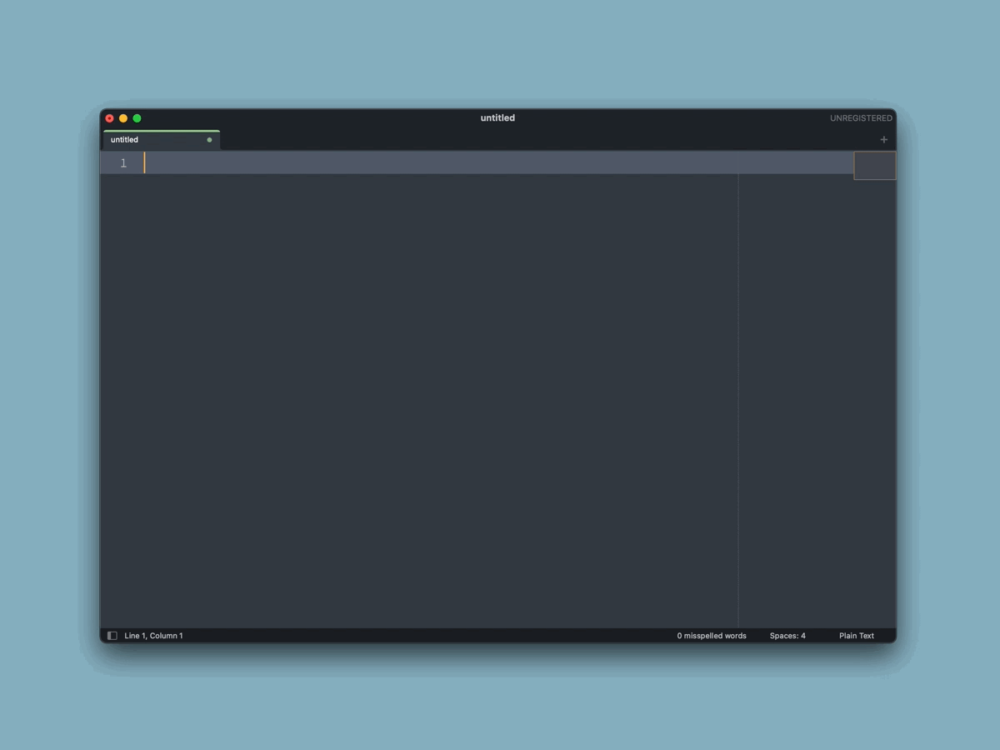

#  snpt-alfred-workflow

[](https://www.npmjs.com/package/snpt-alfred-workflow)
[](http://travis-ci.org/mike182uk/snpt-alfred-workflow)
[](https://www.npmjs.com/package/snpt-alfred-workflow)
[](https://www.npmjs.com/package/snpt-alfred-workflow)
[](http://commitizen.github.io/cz-cli/)

An [Alfred](https://www.alfredapp.com/) workflow for [Snpt](https://github.com/mike182uk/snpt)



## Prerequisites

- [Node.js](https://nodejs.org/en/)
- [Snpt](https://github.com/mike182uk/snpt)
- [FZF](https://github.com/junegunn/fzf)

## Installation

Install the Snpt Alfred workflow builder:

```
npm install -g snpt-alfred-workflow
```

Build the workflow:

```
snpt-alfred-workflow
```

After you have built the workflow you should see a file called `Snpt.alfredworkflow` in the current directory. Double click this file to import the workflow into Alfred.

## Usage

1. Trigger Alfred
2. Type `snpt` and press enter or tab
3. Start typing the name of the snippet you want to copy
4. Press enter on the snippet you want to copy

A notification will be displayed once the snippet has been copied to the clipboard.

## FAQ's

### Why do i have to build the workflow? Can i not just download a pre-built workflow?

Alfred does not know the location of the `node`, `fzf` or `snpt` binaries on your system. As part of building the workflow, any references to these binaries in the workflow scripts are replaced with the correct path to the binary on your system.

## Troubleshooting

### The workflow has stopped working

Try re-building the workflow and re-installing it. It may be that one of the required binaries has moved or been upgraded which will have invalidated the path to it in one of the workflow scripts.
