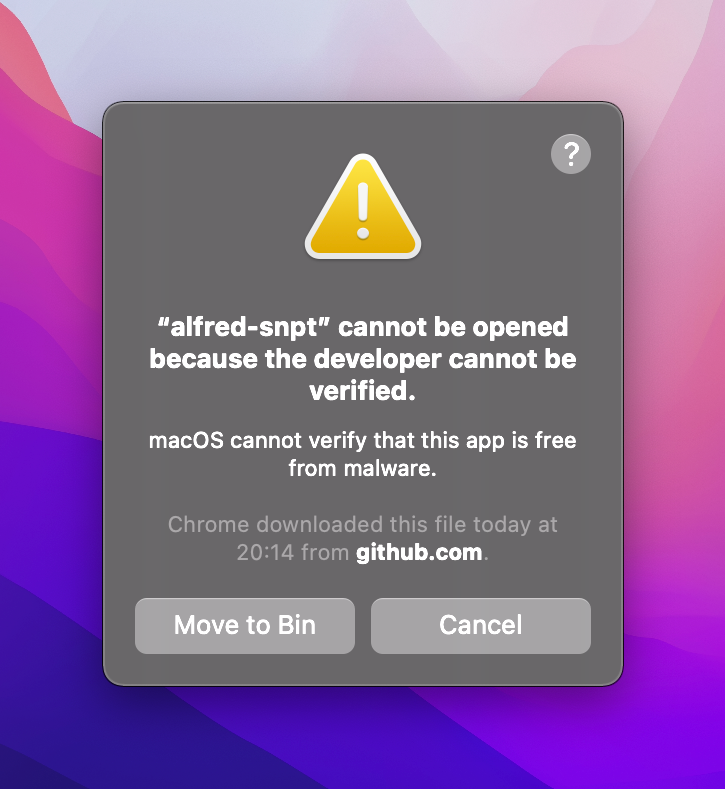
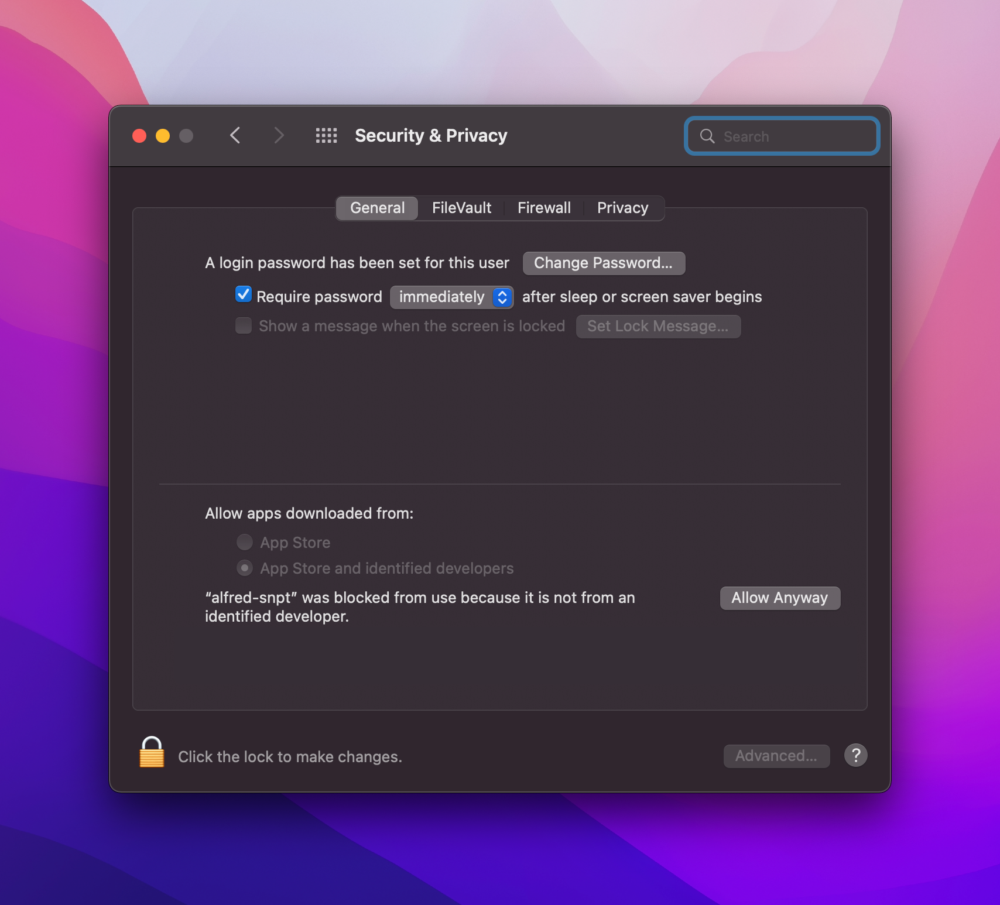
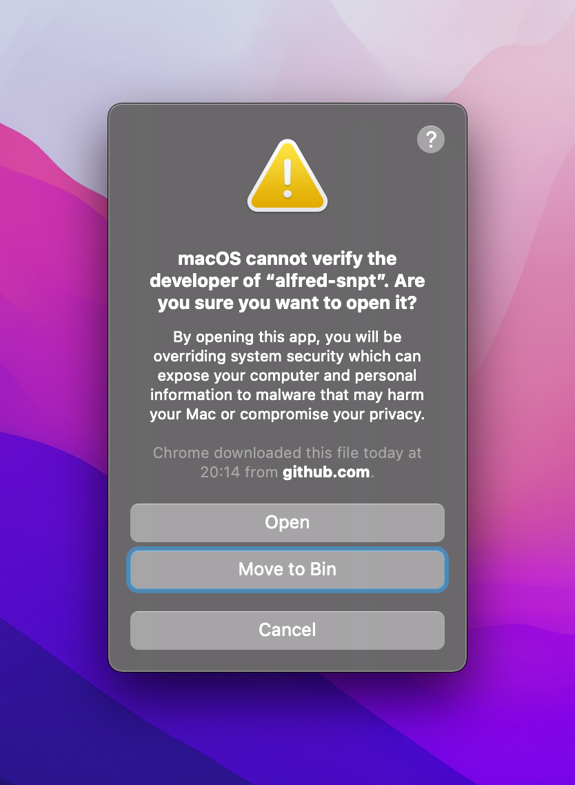

#  alfred-snpt

[](https://github.com/mike182uk/alfred-snpt)
[](https://github.com/mike182uk/alfred-snpt/actions?query=workflow%3ACI)
[](https://github.com/mike182uk/alfred-snpt)
[](https://github.com/mike182uk/alfred-snpt)

An [Alfred](https://www.alfredapp.com/) workflow for [snpt](https://github.com/mike182uk/snpt).


## Prerequisites

- [snpt](https://github.com/mike182uk/snpt)

## Installation

Download the latest version of the workflow from  [here](https://github.com/mike182uk/alfred-snpt/releases).

Alternatively you can build the workflow yourself following the instructions below.

## Usage

1. Trigger Alfred
2. Type `snpt` and press enter or tab
3. Start typing the name of the snippet you want to copy
4. Use the up / down key to navigate to the snippet you want to copy
5. Press enter on the snippet that you want to copy

A notification will be displayed once the snippet has been copied to the clipboard.

## Building the workflow yourself

1. Ensure you have `Go 1.17` installed
2. Clone this repo and navigate into the directory
3. Run `make install` to install the project dependencies
4. Run `make build` to build the workflow

The workflow should be built (`snpt.alfredworkflow`) and placed in the `build` directory.

## Troubleshooting

### I'am seeing the error: "alfred-snpt" cannot be opened because the developer cannot be verified

<div align="center">
  
</div>

You will most likely see this error if you have downloaded the workflow from GitHub. This error is because there is a binary that is packaged with the workflow that was compiled on the build server and has not been [notarized](https://developer.apple.com/documentation/security/notarizing_macos_software_before_distribution).

Don't worry, this binary is not doing anything nefarious, you can verify the source yourself in the `bin` directory.

To get the workflow working: 

- Press the `cancel` button on the dialog
- Go to `System Preferences -> Security & Privacy` and allow `alfred-snpt` to run
<div align="center">
  
</div>

- Try and run the workflow again and if you see the following error, press the `open` button on the dialog
<div align="center">
  
</div>

From now on you should be able to run the workflow without any problems 🎉

**Do not do any of the above if you have not downloaded the workflow from GitHub** - Follow the instructions on how to build workflow yourself.

### The workflow is reporting that `snpt` can not be found

The workflow will search for `snpt` in:

- `/usr/local/bin/`
- `/usr/bin`
- `/bin`
- `/usr/sbin`
- `/sbin`

If you have installed `snpt` to a different location you will need to modify the workflow to use this path:

1. Go to Alfred preferences
2. Select the `snpt` workflow
3. Double click on the `Script Filter` node
4. In the script field, you should see `export PATH=/usr/local/bin/:$PATH` at the top of the field. Modify this to include your path for `snpt`:

```sh
export PATH=/usr/local/bin/:/my/custom/path/bin/:$PATH
```

Repeat the above for each `Run Script` node in the Alfred workflow.
